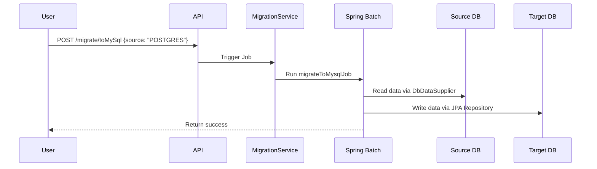
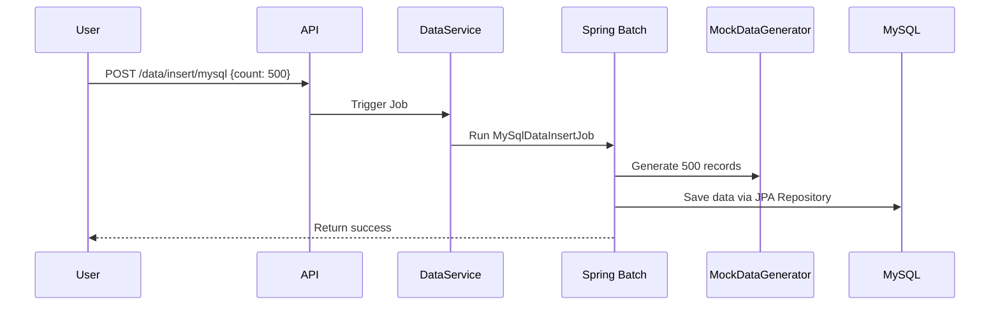

# DB Migrator

A Spring Boot-based tool for **migrating data between relational databases** (MySQL, PostgreSQL, Oracle) and generating
mock datasets. Built with Spring Batch for robust, transactional workflows.

---

## 📌 Table of Contents

- [Features](#-features)
- [Tech Stack](#-tech-stack)
- [Getting Started](#-getting-started)
    - [Prerequisites](#prerequisites)
    - [Local Setup](#local-setup)
    - [Docker Setup](#docker-setup-optional)
- [API Documentation](#-api-documentation)
- [Workflow Details](#-workflow-details)
    - [Data Migration](#data-migration-flow)
    - [Data Insertion](#data-insertion-flow)
- [Configuration](#-configuration)
- [Roadmap](#-roadmap)
- [Contributing](#-contributing)
- [License](#-license)

---

## 🚀 Features

- **Cross-Database Migration**: Move data between MySQL, PostgreSQL, and Oracle.
- **Mock Data Generation**: Insert customizable test datasets into any supported database.
- **Batch Processing**: Chunk-based (100 records/transaction) processing for large datasets.
- **Multi-DB Configuration**: Isolated connection pools and JPA configurations for each database.
- **REST API Integration**: Trigger operations via Swagger-documented endpoints.

---

## 🛠️ Tech Stack

- **Core**: Spring Boot 3.4.2, Java 21
- **Persistence**: Spring Data JPA, Hibernate
- **Batch Processing**: Spring Batch
- **Databases**: MySQL, PostgreSQL, Oracle
- **Utilities**: Lombok, MapStruct, SpringDoc (OpenAPI 3)
- **Build**: Maven

---

## 🏁 Getting Started

### Prerequisites

- Java 21, Maven, Docker (optional).
- Running instances of MySQL, PostgreSQL, and/or Oracle.

### Local Setup

1. **Clone the repository**:
   ```bash  
   git clone https://github.com/CodexParas/db-migrator.git  
   cd db-migrator  
   ```  

2. **Install dependencies**:
   ```bash  
   mvn clean install  
   ```  

3. **Configure databases**:  
   Update `src/main/resources/application.yaml` with your database credentials.

4. **Run the application**:
   ```bash  
   mvn spring-boot:run  
   ```  

### Docker Setup (Optional)

Start databases using Docker:

```bash  
docker-compose up -d  # Launches MySQL, PostgreSQL, and Oracle containers  
```  

---

## 📚 API Documentation

**Interactive Swagger UI**:  
Access at `http://localhost:9121/api/swagger-ui.html` after starting the app.

### Key Endpoints

#### **1. Migrate Data**

```http  
POST /api/migrate/toMySql  
Content-Type: application/json  

{  
  "source": "POSTGRES"  # [MYSQL, POSTGRES, ORACLE]  
}  
```  

**Response**:

```json  
{
  "status": "SUCCESS",
  "message": "Data migrated",
  "data": null
}  
```  

#### **2. Insert Mock Data**

```http  
POST /api/data/insert/mysql  
Content-Type: application/json  

{  
  "count": 1000  # Number of records to generate  
}  
```  

**Response**:

```json  
{
  "status": "SUCCESS",
  "message": "Data inserted",
  "data": null
}  
```  

---

## 🔄 Workflow Details

### Data Migration Flow



**Steps**:

1. **Reader**: Fetches data from the source DB (e.g., PostgreSQL).
2. **Processor**: Pass-through (no transformation; extend for custom logic).
3. **Writer**: Saves data to the target DB (e.g., MySQL) in chunks (100 records/transaction).

---

### Data Insertion Flow



**Steps**:

1. **Reader**: Generates mock data (e.g., names, emails) using `MockDataGenerator`.
2. **Writer**: Inserts records into the target database.

---

## ⚙️ Configuration

### Key `application.yaml` Settings

```yaml  
server:
  port: 9121
  servlet:
    context-path: /api

spring:
  datasource:
    mysql:
      jdbcUrl: jdbc:mysql://localhost:3306/db_migrator
      username: root
      password: root
  batch:
    job.enabled: false       # Disable auto-startup of jobs  
    jdbc.initialize-schema: ALWAYS  # Create batch tables on startup  
```  

### Tuning Batch Jobs

- **Chunk Size**: Adjust in job configurations (e.g., `MigrateToMysql.java`):
  ```java  
  .<MySqlClientEntity, MySqlClientEntity>chunk(200, mySqlTransactionManager)  
  ```  

---

## 🗺️ Roadmap

- **MongoDB Support**: Migrate to/from MongoDB collections.
- **Rollback Mechanism**: API-driven undo for migrations.
- **Enhanced Monitoring**: Integrate Spring Actuator for job metrics.
- **Error Handling**: Retry policies, dead-letter queues.
- **Authentication**: Basic API key/JWT support.

---

## 🤝 Contributing

Contributions welcome!

1. Fork the repository.
2. Create a feature branch (`git checkout -b feature/your-feature`).
3. Add tests for new functionality.
4. Submit a pull request with a detailed description.
